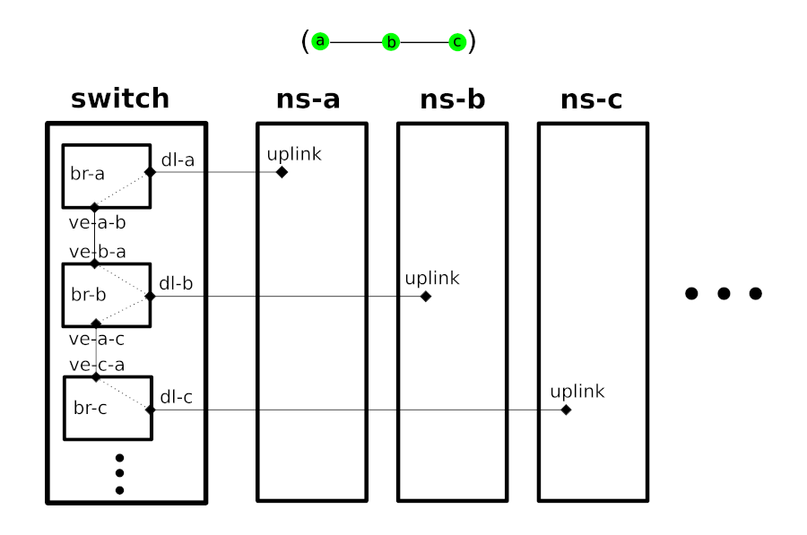

# Mesh Network Lab

Create connected Linux network namespaces each with a single `uplink` interface.
A packet send on an interface will be received on all uplinks in all connected namespaces as defined in the JSON file.

This project is meant for testing Mobile Ad Hoc Mesh routing protocols. Supported are [babel](https://www.irif.fr/~jch/software/babel/), [batman-adv](https://www.open-mesh.org/projects/open-mesh/wiki), [olsr](https://www.olsr.org) and [yggdrasil](https://github.com/yggdrasil-network).

Please note that wireless interference patterns are not part of the simulation.

Topology and link quality changes are supported.

Example JSON file:
```
{
  "links": [
    {
      "source": "a",
      "target": "b",
      "source_tc": "netem delay 10ms 20ms distribution normal",
      "target_tc": "netem loss 0.1"
    },
    {
      "source": "b",
      "target": "c",
      "source_tc": "tbf rate 100mbit burst 8192 latency 1ms",
      "target_tc": "tbf rate 100mbit burst 8192 latency 1ms"
    }
  ]
}
```

JSON keys:

- `source`, `target`: Mandatory. Name of the network namespace. Maximum of 6 characters long.
- `source_tc`, `target_tc`: Optional. It will be appended to the `tc qdisc add dev <veth-interface> root` command and affects outgoing traffic on interface pairs connecting the bridges. (TODO: verify that this actually works)

Useful commands:

- `./network.py list`: List all network namespaces.
- `./network.py clear`: Remove all network namespaces.
- `./network.py change <from-state> <to-state>`: Change the network from `<from-state>` to `<to-state>` via JSON files. `none` can be used as an alias for an empty network.
- `ip netns exec "ns-a" batctl o`: Inspect the state of batman-adv in namespace `ns-a`.

## Usage

Most commands need root. So we assume all commands are execute as root:

```
# Create a 10x10 lattice and write it to a file called graph.json
./topology.py lattice4 10 10 > graph.json

# Setup the network structure
./network.py change none graph.json

# Start batman-adv in every node/namespace
./tests.py batman-adv start

# Test convergence and traffic
./tests.py batman-adv test

# Stop batman-adv
./tests.py batman-adv stop

# Remove namespaces
./network.py change graph.json none
```

As an alternative, you can remove all namespace using `./network.py clear`.

## Internal Working

Every node is represented by its own network namespace and a bridge that resides in namespace `switch`. The node namespace and bridge in `switch` are connected by a veth peer pair `uplink` and `dl-<node>`. Veth interface pairs connect the bridges in the `switch` namespace.

All interfaces in the bridges (except the `dl-<node>`) are set to `isolated`. This makes data flow only to and from the non-isolated `dl-<node>` interface, but not between them.

All bridges have `ageing_time` and `forward_delay` set to 0 to make them behave link a hub. A packet from the uplink will be send to all connections, but not between them.



- Application can be started in ns1, ns2 and see only interface uplink
- bridges have properties `stp_state`, `ageing_time` and `forward_delay` set to 0
- ve-* interfaces have property `isolated` set to `on`

## TODO

- Do not require the present state to be given.
- Better topology generator (more features).
- Mobility

## Related Projects

- [mininet](http://mininet.org/) (uses VirtualBox images and OpenFlow, every link ends in an interface, otherwise very similar)
- [mlc](https://github.com/axn/mlc) (for bmx routing daemon, very complex)
- [network-lab](https://github.com/sudomesh/network-lab) (mesh networks with network namespace, very simple)
- [yggdrasil netns](https://github.com/yggdrasil-network/yggdrasil-go/blob/master/misc/run-schannel-netns) (for yggdrasil only, simple)
- [Running Babel/OLSR/BMX7 inside kubernetes](https://media.freifunk.net/v/multipathtcp-with-un-meshed-networks-and-running-babel-olsr-bmx7-inside-kubernetes-and-containers)
