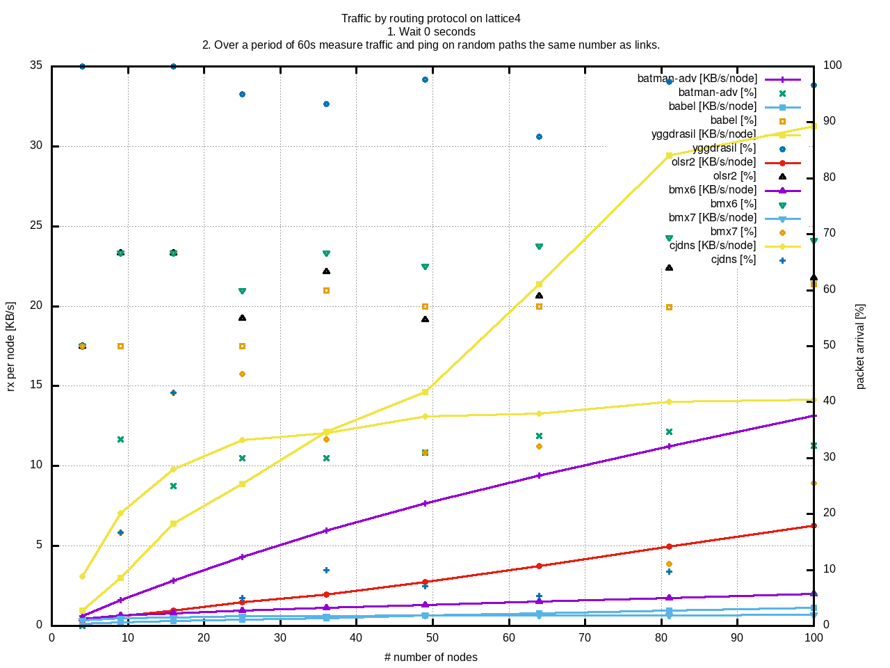
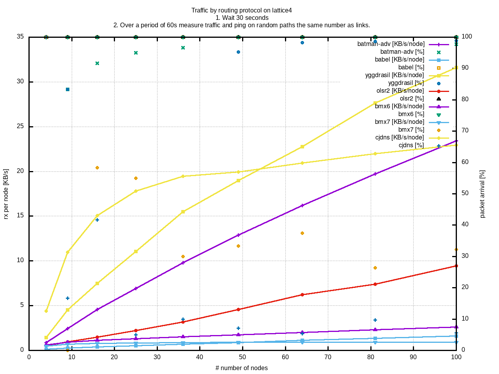
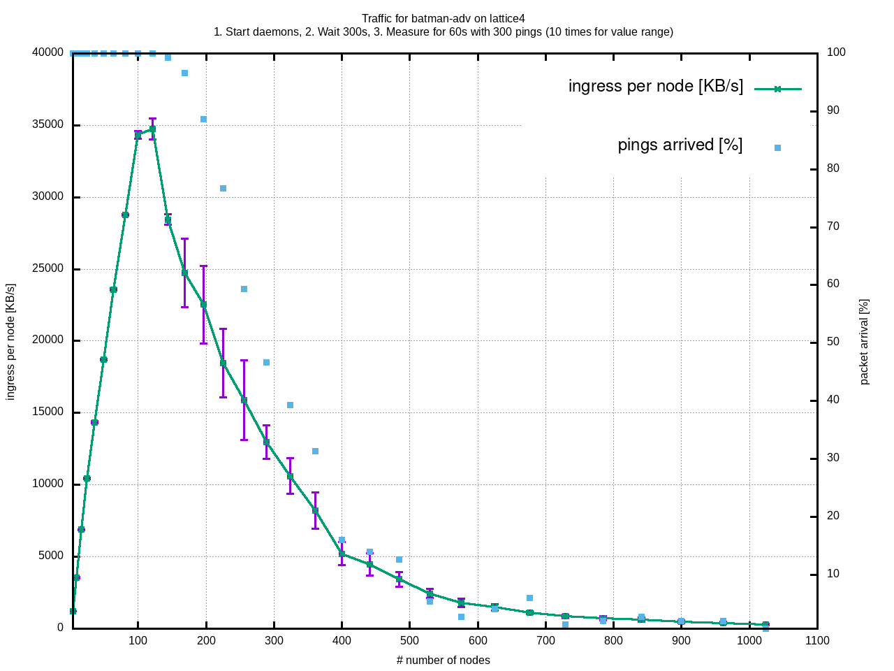

# Test Results

## Environments

Server:

* Debian 10.3 (Linux Kernel 4.19.0-8-amd64)
* 2 x Intel Xeon X5687 (2 * 4 Cores, 3.86 GHz) with 32GB RAM.

Laptop:

* Void Linux (Linux 5.4.27_1 SMP PREEMPT x86_64)
* Intel i7-6500U (2 Cores, 2.50 GHz) with 8GB RAM.

Routing Software:

* yggdrasil (0.3.14)
* batman-adv/batctl (2020.0)
* babel (1.8.3-1)
* olsr2 (v0.15.1-96-g8397c64e)
* bmx6 (v1.0 / 12.05.2018 / d8869ec69797)
* bmx7 (v7.1.1 / 21.07.2019 / 91d6651ccb5a)
* cjdns (v20.5)

## Results

### Convergence1 Test

### Traffic1 Test

Lattice4:

Note that the packet arrival rates are usually pretty bad. This is probably because the software is measured directly after start. Let's wait 30 seconds:

bmx7 and cjdns show a very low arrival rate, so their graphs should be ignored. The worse performer seems to be batman-adv here. But those traffic usage is not backed by reality. But maybe it is because of the lattice structure. Further investigations are needed.

### Traffic2 Test

Only for batman-adv, but with error bars:

Laptop:

The dropping packet arrival rate after 100 nodes might indicate that the system has come to its limits.
